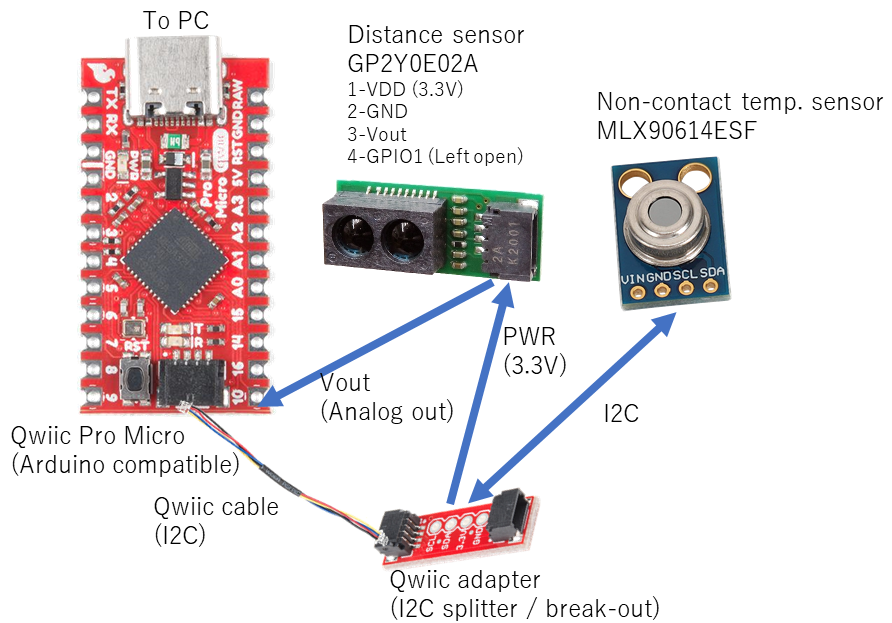

# 概要 Overview
このプログラムは`MLX90614ESF`非接触赤外線放射温度センサを使用して複数人の体温を自動計測し、Excelファイルとして記録するものです。プログラムはディープラーニングベースの顔認識を利用しています。また、温度センサーが計測したおでこ(こめかみ)の温度と、周囲温度から体温を推定しています。  
This program measures the body temperature of multiple people using `MLX90614ESF` non-contact IR temperature sensor and record the result as an Excel file. The program employs deep learning based AI face recognition to identify the person with webCAM. Also, the program estimates the core body temperature from the forehead temperature and ambient temerature measured by the non-contact temperature sensor.  

# 実行方法 How to run

## 1.顔撮影 Capturing face image (WebCam -> `.JPG`)  
'`顔撮影.bat`'を使って撮影。  
- 出席番号(ID番号)、氏名(英文字＋'_'のみ使用可。日本語不可)を入力して開始。
- カメラ画像のウインドウが選択されている状態で**スペースキー**を押すと写真保存（自動で番号が付加される）。  
- 別の人を撮影するときには一度プログラムを終了(ESCキー)して再度ID番号入力。  
- 保存される写真は'`{ID}-{NAME}-{NUM}.jpg`'となる (例えば`28-Yamada_Tato-01.jpg`)。最後の番号は撮影するごとに自動で増える。  

## 2. 顔データベース作成 Generating face feature vector DB (`.JPG` -> `.JSON`)  
'`顔データベース生成.bat`'を実行。  
このプログラムでは、顔の特徴量ベクトルどうしを比較して顔判定を行う。そのために顔写真から顔の特徴量を事前に計算してファイルとして保存するためのプログラム。  
- `./face_images`フォルダ内のJPEG顔写真ファイルから特徴量を計算し、`./face_db`フォルダにJSONファイル(特徴量ファイル)を作成する。  
- 温度計測プログラムはこの特徴量だけを使って顔照合を行うので、一度特徴量ファイルを生成してしまえば元となる顔写真は削除しても問題ない（セキュリティ、プライバシーの観点からも削除すべき）。  

## 3. 体温計測 Measuring body temerature ( 体温測定 -> `.xlsx`)  
`自動体温計.bat`を実行。  
- 距離センサーに4.0~5.0cmの範囲に近づいた時の体温データを測定。計測時には音が鳴る。同つ人物の体温データが複数取得された場合、最後に平均を取ってその値を使用する。  
- 顔認識にはPCのカメラを使用する。画面内から検出した複数の顔のうち、最も検出枠が大きく、かつ検出枠の大きさが一定以上(画面の1/3以上の大きさ)のものに対して顔照合を実行し個人を特定する。これにより後ろに写り込む他の人を除外している。
- 体温計測には赤外線放射温度センサーを使用している。計測したおでこの温度をセンサー温度(=室温)で補正し、体温を推定している。
- プログラムは'**最後に認識した個人**'を記録しており、計測した体温は'**最後に認識した個人**'のものとして記録する。そのため、体温測定時に顔認識がされている必要はない。**ただし、別の人の顔が認識されてしまうとその人のデータとして記録されてしまう恐れがあるので注意。**
- `ESC`を押すとプログラムは終了する。
- プログラム終了時に`body_temp_record_{YYYY}{MM}{DD}-{hh}{mm}.xlsx`というファイル名のエクセルファイルを作成し、計測したデータを保存する(例: `body_temp_record_20211003-083021.xlsx`)。
- エクセルファイル内のフォーマットは、下記の通り。
 出席番号ID, 氏名, 体温(補正済み), 測定温度(おでこの温度), 室温(センサー温度)

# Pythonプログラム

|program|description|
|----|----|
|`capture_image.py`|USB webCamから画像を取得してJPEG画像として保存。保存先はconfig.pyのimage_dirで指定。"cam"ウインドウがアクティブになってる必要がある（マウスでクリック）|
|`register_faces.py`|JPEGイメージから顔を検出し、データベースに登録。データはJSONファイルとして、出席番号、氏名、顔の特徴ベクトルとともに保存される。イメージデータはimage_dir、データベースレコード(JSON)はdatabase_dirで指定(config.py)。JSONファイル作成後は元のJPEGファイルは必要ない（削除可能）|
|`thermometer.py`|体温測定プログラム。ESCキーで終了したときに測定結果を保存したEXCELファイルを作成|

# Hardware Configuration

# 部材

|Manufacturer|PN|Description|Qty|URL|Price (JPY)|
|----|----|----|----|----|----|
|SparkFun|SFE-DEV-15795|Qwiic Pro Micro (USB-C, 5V/16MHz)|1|https://www.switch-science.com/catalog/6228/|2,294|
|SparkFun|SFE-DEV-14495|Qwiic adapter|1|https://www.switch-science.com/catalog/3594/|180|
|SparkFun|SFE-PRT-14426|Qwiic cable 50mm|1|https://www.switch-science.com/catalog/3542/|133|
|*|*|USB webCam, FOV~60deg, >VGA|1|-|
|Fhdpeebu|-|MLX90614ESF Non-contact temperature sensor module|1|https://www.amazon.co.jp/gp/product/B095JNFNK9|1,690|
|-|SHARP|GP2Y0E02A IR distance sensor|1|https://akizukidenshi.com/catalog/g/gI-07546/|720|
|~~Switch Science~~|~~SSCI-033954~~|~~Conta(tm) Thermography module - AMG8833~~|~~1~~|https://www.switch-science.com/catalog/3395/|4,950|

